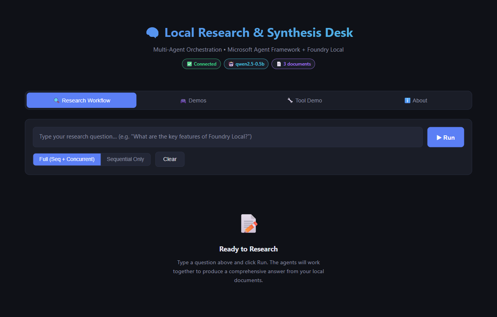
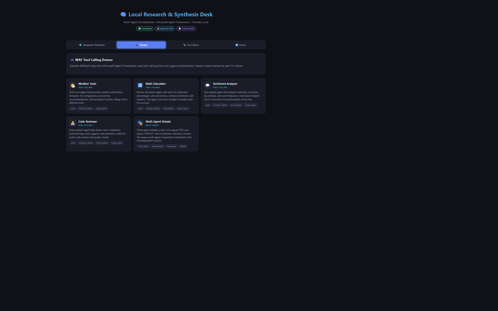
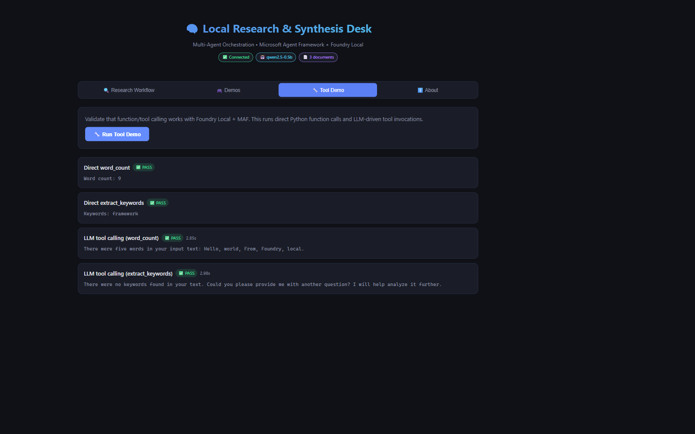
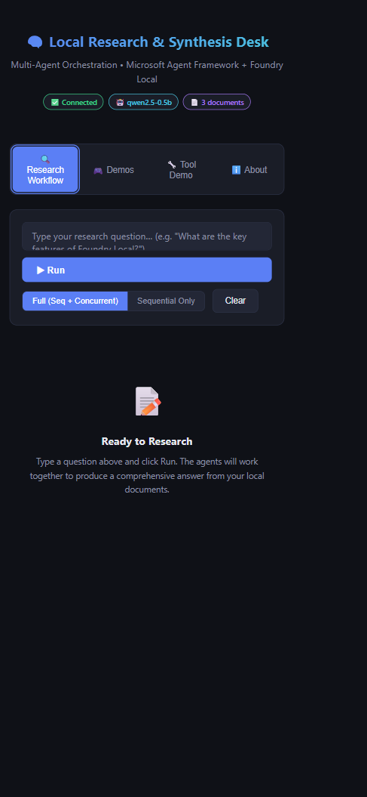

# Local Research & Synthesis Desk


**Multi-agent orchestration** demo using [Microsoft Agent Framework (MAF)](https://learn.microsoft.com/en-us/agent-framework/) and [Foundry Local](https://foundrylocal.ai) — everything runs on your machine, no cloud API keys needed.

---

## Quick Start (TL;DR)

```bash
# 1. Install Foundry Local → https://github.com/microsoft/Foundry-Local
# 2. Set up Python
python -m venv .venv && .venv\Scripts\activate
pip install -r requirements.txt
copy .env.example .env

# 3. Run the demo
python -m src.app "What are the key features of Foundry Local?" --docs ./data

# 4. Launch the web UI
python -m src.app.web
```

---

## What You'll Learn

This demo teaches you how to:

- **Bootstrap Foundry Local** from Python using `foundry-local-sdk`
- **Create specialised agents** (Planner, Retriever, Critic, Writer) with MAF's `ChatAgent`
- **Wire agents to a local LLM** via MAF's `OpenAIChatClient` (OpenAI-compatible API)
- **Orchestrate agents sequentially** — a pipeline where each agent builds on the previous output
- **Orchestrate agents concurrently** — fan-out independent tasks in parallel with `asyncio.gather`
- **Use function/tool calling** — let the LLM invoke Python functions (`word_count`, `extract_keywords`)
- **Build a web UI** — a browser-based interface that streams agent progress in real time

---

## Screenshots

### Desktop View — Research Workflow



The main interface with the research workflow tab, showing the agent pipeline and input form.

### Desktop View — Demos Tab



Interactive demos showcasing different MAF capabilities including weather tools, math calculator, sentiment analyzer, code reviewer, and multi-agent debate.

### Desktop View — Tool Demo



The tool calling demo showing word count and keyword extraction tools in action.

### Mobile View



Responsive design adapts to mobile screens with touch-friendly controls and optimized layout.

---

## What This Demo Does

You type a research question. Four AI agents collaborate locally to answer it:

| Agent | Role |
|-------|------|
| **Planner** | Breaks your question into sub-tasks |
| **Retriever** | Reads local files and extracts relevant snippets with citations |
| **Critic** | Reviews for gaps and contradictions |
| **Writer** | Produces a final report citing your local documents |
| **ToolAgent** *(optional)* | Computes word counts and keyword extraction |

The demo shows **two orchestration patterns** in a single run:

1. **Sequential pipeline** — Planner runs first, then Retriever, Critic, Writer in order (each agent needs the previous agent's output).
2. **Concurrent fan-out** — Retriever and ToolAgent run *in parallel* (they don't depend on each other), saving time.

```
User question
     │
     ▼
  Planner          ← sequential (must run first)
     │
     ├──► Retriever ┐
     │               ├─► merge   ← concurrent (independent tasks)
     └──► ToolAgent ┘
              │
              ▼
           Critic          ← sequential (needs retriever output)
              │
              ▼
           Writer          ← sequential (needs everything above)
              │
              ▼
        Final Report
```

## Prerequisites

| Requirement | Version | Link |
|---|---|---|
| Python | 3.10 or higher | [python.org](https://www.python.org/downloads/) |
| Foundry Local | Latest | [github.com/microsoft/Foundry-Local](https://github.com/microsoft/Foundry-Local) |

## Setup (5 minutes)

### 1. Install Foundry Local

Follow the instructions at [github.com/microsoft/Foundry-Local](https://github.com/microsoft/Foundry-Local) to install the Foundry Local runtime for your OS.

Verify it works:

```bash
foundry --help
```

### 2. Clone this repo and create a virtual environment

```bash
git clone <this-repo-url>
cd agentframework-foundrylocal

python -m venv .venv
```

Activate the environment:

```bash
# Windows
.venv\Scripts\activate

# macOS / Linux
source .venv/bin/activate
```

### 3. Install Python dependencies

```bash
pip install -r requirements.txt
```

### 4. Set up your configuration

```bash
copy .env.example .env
```

The default settings use the `qwen2.5-0.5b` model alias. Foundry Local automatically picks the best hardware variant (GPU, NPU, or CPU) for your machine.

> **Tip:** Run `foundry model list` to see all available model aliases. The `qwen2.5` family supports function/tool calling, which the ToolAgent needs. For better quality, try `--model qwen2.5-7b` or `--model qwen2.5-14b`.

### 5. (Optional) Verify Foundry Local with a quick test

```bash
foundry model run qwen2.5-0.5b
```

Type a question, see a response, press Ctrl+C to exit.

## Run the Demo

```bash
python -m src.app "What are the key features of Foundry Local and how does it compare to cloud inference?"
```

With a custom documents folder:

```bash
python -m src.app "Summarise the orchestration patterns" --docs ./data
```

Sequential-only mode (simpler pipeline, no parallel step):

```bash
python -m src.app "Explain multi-agent benefits" --docs ./data --mode sequential
```

### Launch the Web UI

Run the browser-based interface for an interactive experience:

```bash
python -m src.app.web
```

Open [http://localhost:5000](http://localhost:5000) in your browser. The web UI provides:

- A text input for your research question
- Real-time streaming of each agent's progress
- Visual pipeline showing Sequential and Concurrent orchestration
- Mode toggle (Full / Sequential)
- Tool calling demo tab

### Validate Tool/Function Calling

Run the dedicated tool calling demo to verify function calling works:

```bash
python -m src.app.tool_demo
```

This tests:
- Direct tool function calls (word_count, extract_keywords)
- LLM-driven tool calling via the ToolAgent
- Multi-tool requests in a single prompt

### CLI Options

| Flag | Default | Description |
|---|---|---|
| `"question"` | *(required)* | Your research question |
| `--docs` | `./data` | Folder of local documents to search |
| `--model` | `qwen2.5-0.5b` | Foundry Local model alias |
| `--mode` | `full` | `full` (sequential + concurrent) or `sequential` |
| `--log-level` | `INFO` | `DEBUG`, `INFO`, `WARNING`, `ERROR` |

## Project Structure

```
├── .env.example          # Config template
├── pyproject.toml        # Project metadata & dependencies
├── requirements.txt      # Pinned dependencies
├── LICENSE               # MIT License
├── CONTRIBUTING.md       # Contribution guidelines
├── SECURITY.md           # Security policy
├── data/                 # Sample documents for the Retriever
│   ├── foundry_local_overview.md
│   ├── agent_framework_guide.md
│   └── orchestration_patterns.md
├── src/app/
│   ├── __init__.py
│   ├── __main__.py       # CLI entry point
│   ├── foundry_boot.py   # Foundry Local SDK bootstrapper
│   ├── agents.py         # Agent definitions (Planner, Retriever, Critic, Writer, ToolAgent)
│   ├── documents.py      # Local file loader with chunking
│   ├── orchestrator.py   # Sequential + Concurrent orchestration engine
│   ├── tool_demo.py      # Tool/function calling validation demo
│   ├── web.py            # Flask web UI (browser-based interface)
│   ├── templates/
│   │   └── index.html    # Web UI frontend (HTML + CSS + JS)
│   └── demos/            # Interactive tool calling demos
│       ├── __init__.py
│       ├── registry.py       # Demo registry with metadata
│       ├── weather_tools.py  # Weather info with 4 tools
│       ├── math_agent.py     # Calculator with 6 math tools
│       ├── sentiment_analyzer.py  # Text analysis with 5 tools
│       ├── code_reviewer.py  # Code analysis with 5 tools
│       └── multi_agent_debate.py  # 3-agent debate system
└── tests/
    └── test_smoke.py     # Smoke tests (no GPU/service required)
```

## How It Works — Architecture

```
┌─────────────────────────────────────────────────────────┐
│                    Your Machine                          │
│                                                          │
│  ┌──────────────┐    Control Plane     ┌──────────────┐ │
│  │  Python App   │───(foundry-local-sdk)──►│Foundry Local │ │
│  │  (MAF agents) │                     │   Service     │ │
│  │               │    Data Plane       │              │ │
│  │  OpenAIChatClient──(OpenAI API)────►│  Model (LLM) │ │
│  └──────────────┘                     └──────────────┘ │
└─────────────────────────────────────────────────────────┘
```

**Control plane** — The `FoundryLocalManager` from `foundry-local-sdk` starts the service, downloads models, and returns the endpoint URL. ([SDK reference](https://learn.microsoft.com/en-us/azure/ai-foundry/foundry-local/reference/reference-sdk?view=foundry-classic))

**Data plane** — MAF's `OpenAIChatClient` sends chat completions to Foundry Local's OpenAI-compatible API (typically `http://localhost:<port>/v1` — the port is assigned dynamically). No separate OpenAI key is needed.

## Example Output

When you run the demo, you'll see agent-by-agent progress in the terminal:

```
┌─ Local Research & Synthesis Desk ─┐
│ Multi-Agent Orchestration • MAF + Foundry Local │
│ Mode: full                                       │
└──────────────────────────────────────────────────┘

  Model : qwen2.5-0.5b-instruct-cuda-gpu:4  (alias: qwen2.5-0.5b)
  Documents: 3 file(s), 4 chunk(s) from ./data

┌─────────────────────────────────────────┐
│ 🗂  Planner — breaking the question …   │
└─────────────────────────────────────────┘
  1. Identify key features of Foundry Local …
  2. Compare on-device vs cloud inference …
  ⏱  2.3s

⚡ Concurrent fan-out — Retriever + ToolAgent running in parallel …
  Retriever finished in 3.1s
  ToolAgent finished in 1.4s

┌─────────────────────────────────────────┐
│ ✍️  Writer — composing the final report │
└─────────────────────────────────────────┘
  (Final synthesised report with citations)
  ⏱  4.2s

✅ Workflow complete — Total: 14.8s, Steps: 5
```

## Run Tests

```bash
pip install pytest pytest-asyncio
pytest tests/ -v
```

The smoke tests check document loading, tool functions, and configuration — they do **not** require a running Foundry Local service.

---

## Interactive Demos

The web UI includes a **Demos** tab with 5 interactive demos showcasing different MAF capabilities. Each demo has a suggested prompt you can use directly.

| Demo | Category | Description | Suggested Prompt |
|------|----------|-------------|------------------|
| **🌤️ Weather Tools** | Tool Calling | Multi-tool agent providing weather info, forecasts, city comparisons, and activity recommendations. Uses 4 different tools. | `What's the weather in Seattle and San Francisco? Compare them and recommend activities for the warmer city.` |
| **🔢 Math Calculator** | Tool Calling | Precise calculation agent with tools for arithmetic, percentages, unit conversions, compound interest, and statistics. Uses tools instead of mental math for accuracy. | `If I invest $10,000 at 7% annual interest compounded monthly for 15 years, how much will I have? Also convert that to euros assuming 1 USD = 0.92 EUR.` |
| **💬 Sentiment Analyzer** | Tool Calling | Text analysis agent that detects sentiment, emotions, key phrases, and word frequency. Uses lexicon-based tools for structured analysis. | `Analyze this review: 'The product arrived quickly and the quality exceeded my expectations. However, the packaging was disappointing and customer support was slow to respond.'` |
| **👨‍💻 Code Reviewer** | Tool Calling | Code analysis agent that checks style, complexity, potential bugs, and suggests improvements. Useful for quick code reviews. | `Review this Python code: def calc(x,y,z): result = x + y; if result == None: return 0; return result / z` |
| **🎭 Multi-Agent Debate** | Multi-Agent | Three agents debate a topic: one argues FOR, one argues AGAINST, and a moderator declares a winner. Showcases sequential orchestration with interdependent outputs. | `Remote work should become the default for all knowledge workers` |

### Demo Features

- **Tool Calling Demos**: Show how MAF agents invoke Python functions decorated with Pydantic metadata
- **Multi-Agent Demo**: Demonstrates sequential orchestration where agents receive output from previous agents
- **Suggested Prompts**: Click "Use This" to copy the suggested prompt directly into the input field
- **Real-time Results**: See agent outputs streamed as they complete

Access demos at: [http://localhost:5000](http://localhost:5000) → **Demos** tab

---

## Troubleshooting

| Problem | Solution |
|---|---|
| `foundry: command not found` | Install Foundry Local: [github.com/microsoft/Foundry-Local](https://github.com/microsoft/Foundry-Local) |
| `foundry-local-sdk is not installed` | Run `pip install foundry-local-sdk` |
| Model download is slow | First download can be large. It's cached for future runs. |
| `No documents found` warning | Add `.txt` or `.md` files to the `--docs` folder |
| Agent output is low quality | Try a larger model alias, e.g. `--model phi-3.5-mini` |
| Web UI won't start | Ensure Flask is installed: `pip install flask` |
| Port 5000 in use | The web UI uses port 5000. Stop other services or set `PORT=8080` env var |

## References

- **Foundry Local**: [foundrylocal.ai](https://foundrylocal.ai)
- **Foundry Local SDK (Python)**: [Microsoft Learn](https://learn.microsoft.com/en-us/azure/ai-foundry/foundry-local/reference/reference-sdk?view=foundry-classic)
- **Foundry Local repo**: [github.com/microsoft/Foundry-Local](https://github.com/microsoft/Foundry-Local)
- **Foundry Local CLI reference**: [Microsoft Learn](https://learn.microsoft.com/en-us/azure/ai-foundry/foundry-local/reference/reference-cli?view=foundry-classic)
- **Microsoft Agent Framework**: [learn.microsoft.com/en-us/agent-framework](https://learn.microsoft.com/en-us/agent-framework/)
- **Agent Framework core (PyPI)**: [pypi.org/project/agent-framework-core](https://pypi.org/project/agent-framework-core/)
- **Agent Framework Samples**: [github.com/microsoft/Agent-Framework-Samples](https://github.com/microsoft/Agent-Framework-Samples)
- **MAF Orchestrations overview**: [Microsoft Learn](https://learn.microsoft.com/en-us/agent-framework/user-guide/workflows/orchestrations/overview)

## License

This project is licensed under the MIT License - see [LICENSE](LICENSE) for details.
